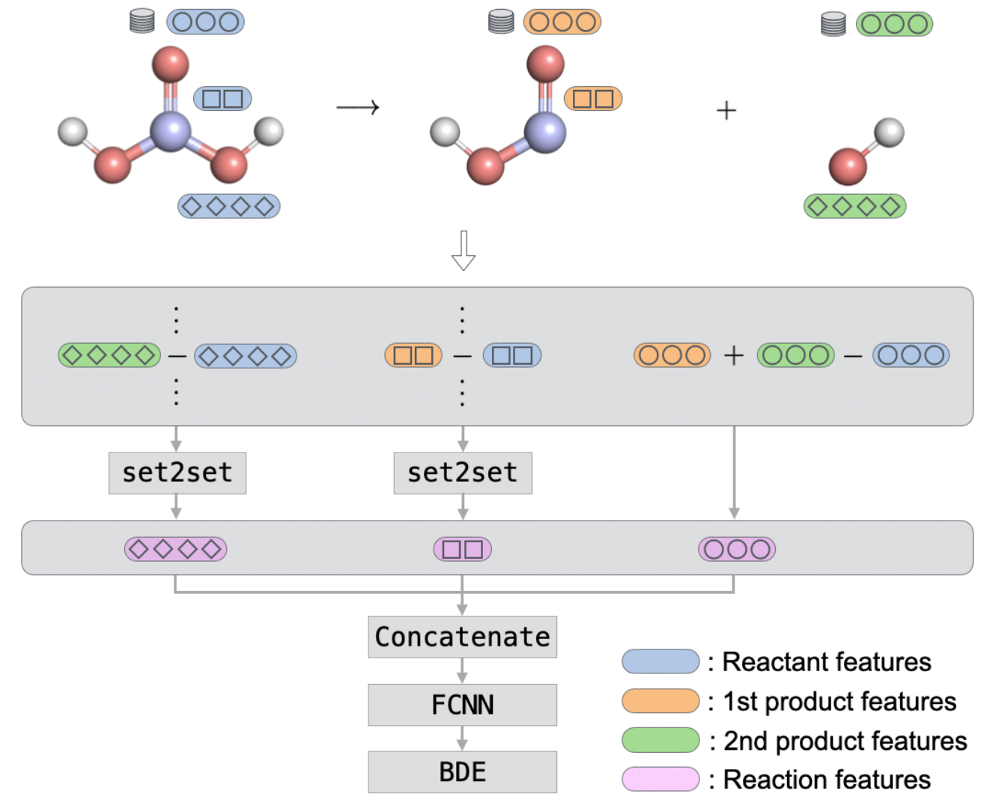

Use the pretrained model:
[](https://mybinder.org/v2/gh/mjwen/bondnet/pretrained?filepath=bondnet%2Fscripts%2Fpredict_binder.ipynb)

Train the model:
[](https://mybinder.org/v2/gh/mjwen/bondnet/pretrained?filepath=bondnet%2Fscripts%2Ftrain_bde.ipynb)

# Table of Contents

- [Table of Contents](#table-of-contents)
- [Installation](#installation)
- [Use pretrained model for prediction](#use-pretrained-model-for-prediction)
- [Train the model](#train-the-model)

BonDNet is a graph neural network model for the prediction of bond dissociation
energies (BDEs). It can be applied to both homolytic and heterolytic bond dissociations
for molecules of any charge. This model is described in the paper:
[BonDNet: a graph neural network for the prediction of bond dissociation
energies for charged molecules, _Chemical Science_, 2021.](https://doi.org/10.1039/D0SC05251E)

<p align="center">

</p>

# Installation

Currently, we support installation from source:

1. create a conda environment

   ```bash
   conda create --name bondnet
   conda activate bondnet
   conda install python
   ```

2. install dependencies

   ```bash
   conda install "pytorch>=1.10.0" -c pytorch
   conda install "dgl>=0.5.0" -c dglteam
   conda install "pymatgen>=2022.01.08" "rdkit>=2020.03.5" "openbabel>=3.1.1" -c conda-forge
   ```

3. install this repo
   ```bash
   git clone https://github.com/mjwen/bondnet.git
   pip install -e bondnet
   ```

# Use pretrained model for prediction

The predicted BDE will be in the units of `eV`.

For a quick prediction of the BDEs for a single molecule, try the live demo at:
[](https://mybinder.org/v2/gh/mjwen/bondnet/pretrained?filepath=bondnet%2Fscripts%2Fpredict_binder.ipynb)

Alternatively, a command line interface (CLI) `bondnet` is provided for batch predictions.

- A single molecule given by a `SMILES` or `InChI` string, e.g.:

  ```bash
  bondnet single "C1COC(=O)O1"
  ```

- Multiple molecules listed in a file. Supported molecule format includes `sdf`, `pdb`, `smiles` and `inchi`, e.g.:

  ```bash
  bondnet multiple molecules.sdf -o results.sdf
  ```

- Explicitly specifying the bond dissociation reactions. In this mode, a `moleclue` file
  listing all the molecules and a `reaction` file listing all the bond dissociation
  reactions are needed. Supported molecule format includes `graph `, `sdf`, `pdb`,
  `smiles `, and `inchi`. e.g.
  ```bash
  bondnet reaction -t graph molecule_graphs.json reactions.csv
  bondnet reaction -t sdf molecules.sdf reactions.csv
  ```

## More information

- More detailed instructions, example input files, and description of the file formats,
  can be found [here](./bondnet/scripts/examples/predict).
- To get help, do `bondnet -h`. Help of subcommand can be obtained by, e.g. `bondnet single -h`

# Train the model

A new implementation of BondNet can be found [here](https://github.com/mjwen/rxnrep/tree/bondnet), which trains ~4 times faster. But the below instructions should still work.

~~The [train_bde.ipynb](./bondnet/scripts/train_bde.ipynb) Jupyter notebook shows how to train BonDNet on a BDE dataset of both neutral and charged molecules. Try it at: [](https://mybinder.org/v2/gh/mjwen/bondnet/pretrained?filepath=bondnet%2Fscripts%2Ftrain_bde.ipynb)~~

~~The [train_bde.ipynb](./bondnet/scripts/train_bde.ipynb) Jupyter notebook trains a model on CPU. If you want to train on GPUs (a single GPU or distributed), take a look at [train_bde_distributed.py](./bondnet/scripts/train_bde_distributed.py). A model can be trained by~~

```bash
python train_bde_distributed.py  molecules.sdf  molecule_attributes.yaml  reactions.yaml
```

~~More detailed instructions, example input files, and description of the file formats, can be found [here](./bondnet/scripts/examples/train).~~
